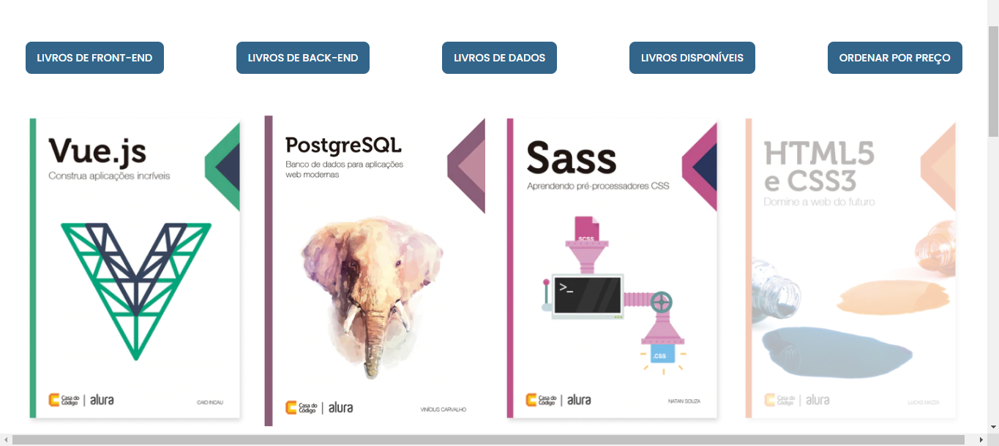

# Alura - AluraBooks

Course provided by **Alura**, which has **Guilherme Lima** as an instructor, 
[Course Link](https://cursos.alura.com.br/course/javascript-metodos-array)

## Preview 

## Differences bettwen my code

- Displayed prices
  - This happens because we have to do one discount calc in one moment of the course, and at this moment the calc is mentioned as
      a business rule of this project, as the course goes on, this is never more mentioned, so I decided to make this rule real
      uring all the code.
- Features implementations
  - This happens because I do all the code on my own, and of course, I have been influenced sometimes by the instructor,
      but overall, My code is different.
    
## Major Knowledge 

This course focuses on how to use the array methods to manipulate the DOM elements.
